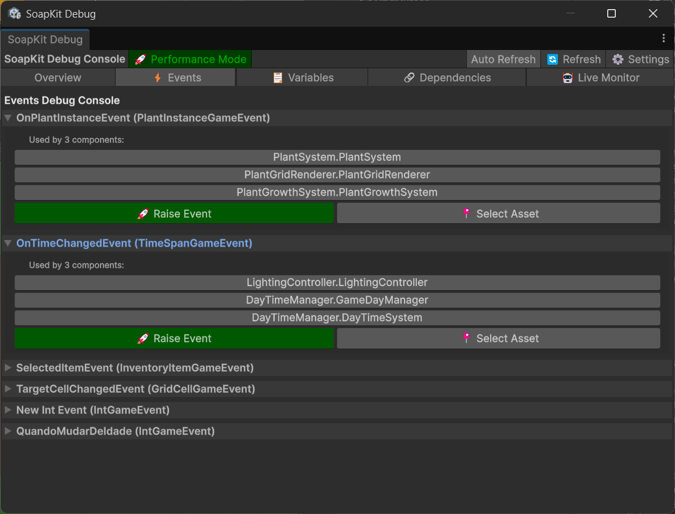

# SoapKit Debug Window

The **SoapKit Debug Window** is your mission control center for monitoring, testing, and debugging your SOAP architecture. This professional-grade tool provides real-time insights into your events, variables, and system performance.

## Opening the Debug Window

Access the Debug Window through Unity's menu:
```
Tools > SoapKit > Debug Window
```

## Overview

The Debug Window consists of several tabs, each providing specific debugging capabilities:

- **📊 Monitor** - Real-time variable and event monitoring
- **🎯 Events** - Event testing and history
- **📈 Variables** - Variable inspection and manipulation
- **⚡ Performance** - Performance analysis and bottleneck detection
- **🔗 Dependencies** - Visual dependency mapping
- **🎮 Live Testing** - Runtime testing tools

## Monitor Tab

### Real-Time Dashboard

The Monitor tab provides a live dashboard of your SOAP systems:


**Key Features:**
- **Variable Values**: Live updates of all variable values during gameplay
- **Event Activity**: Real-time event firing with frequency indicators
- **System Status**: Health indicators for each SOAP system
- **Performance Metrics**: CPU usage, memory allocation, and event throughput

### Variable Monitoring

```csharp
// Variables appear automatically in the monitor
public class PlayerHealth : MonoBehaviour
{
    [SerializeField] private IntVariable health; // Shows in Variables section
    [SerializeField] private FloatVariable speed; // Shows in Variables section
    
    // Values update in real-time during play mode
}
```

**Monitor Display:**
```
📊 Variables
├── PlayerHealth (IntVariable): 85/100
├── PlayerSpeed (FloatVariable): 5.2
├── PlayerName (StringVariable): "Hero"
└── IsGamePaused (BoolVariable): false
```

### Event Activity Feed

The activity feed shows recent event firings:

```
🎯 Recent Events (Last 50)
[14:32:15] OnHealthChanged(85) → 3 listeners
[14:32:14] OnPlayerMoved(Vector3(2,0,3)) → 5 listeners  
[14:32:12] OnEnemyDied() → 7 listeners
[14:32:10] OnScoreChanged(1250) → 2 listeners
```

**Event Information:**
- **Timestamp**: When the event was raised
- **Event Name**: The ScriptableObject asset name
- **Parameters**: The value passed to the event
- **Listener Count**: How many systems are subscribed

## Events Tab

### Manual Event Testing

Test any event manually without requiring gameplay triggers:



**Features:**
- **Event List**: All events in your project with current listener counts
- **Parameter Input**: Type-safe parameter entry for each event type
- **Raise Button**: Fire events manually for testing
- **Batch Testing**: Raise multiple events in sequence
- **Event Templates**: Save common test scenarios

### Event Testing Examples

**Testing Health System:**
1. Find `OnHealthChanged` in the Events list
2. Enter test value: `50`
3. Click **Raise Event**
4. Observe UI, audio, and other systems react

**Testing State Changes:**
1. Select `OnGameStateChanged` event
2. Choose state from dropdown: `"Paused"`
3. Click **Raise Event**
4. Verify pause menu appears and game stops

### Event History

View detailed history of event activity:

```csharp
// Access event history programmatically
#if UNITY_EDITOR
void Start()
{
    var history = onHealthChanged.GetEventHistory();
    foreach(var entry in history)
    {
        Debug.Log($"Event at {entry.timestamp}: {entry.value}");
    }
}
#endif
```

**History Features:**
- **Timeline View**: Events displayed chronologically
- **Filtering**: Filter by event type, time range, or parameter values
- **Export**: Save history to CSV for analysis
- **Statistics**: Event frequency, peak times, and patterns

## Variables Tab

### Variable Inspector

Deep inspection and manipulation of variable values:


**Capabilities:**
- **Live Editing**: Change values during gameplay
- **Constraint Visualization**: See min/max limits graphically
- **Change History**: Track how values change over time
- **Validation Status**: See constraint violations and validation errors
- **Quick Actions**: Reset, randomize, or apply presets

### Variable Operations

**Real-Time Value Editing:**
```csharp
// Change values from the Debug Window during gameplay
// Values update immediately in your game systems
```

**Constraint Testing:**
- **Min/Max Validation**: Test edge cases by setting values at limits
- **Invalid Values**: See how your systems handle constraint violations
- **Null Testing**: Test null GameObject and Transform variables

**Performance Testing:**
- **Rapid Changes**: Stress test with rapid value changes
- **Memory Monitoring**: Watch for memory leaks during value changes
- **Event Frequency**: Monitor how often change events fire

## Performance Tab

### System Performance Analysis


The Performance tab helps identify bottlenecks and optimization opportunities:

**Metrics Tracked:**
- **Event Performance**: Time taken for each event dispatch
- **Listener Performance**: CPU time per listener callback
- **Memory Usage**: Variable and event memory consumption
- **Allocation Tracking**: Garbage collection from SOAP operations

### Performance Insights

**Event Hotspots:**
```
⚡ Slowest Events (avg. time per raise)
1. OnComplexCalculation: 2.3ms (15 listeners)
2. OnUIUpdate: 1.8ms (8 listeners)
3. OnPhysicsChanged: 0.9ms (12 listeners)
```

**Memory Hotspots:**
```
💾 Memory Usage
├── Variables: 2.4KB (145 assets)
├── Event History: 1.8KB (500 entries)
├── Listeners: 0.6KB (67 subscriptions)
└── Total SOAP Memory: 4.8KB
```

### Performance Recommendations

The Debug Window provides actionable optimization advice:

**Example Recommendations:**
- "⚠️ `OnMouseMove` event fires 60x/second - consider throttling"
- "💡 `PlayerHealth` has 12 listeners - consider using fewer, more focused events"
- "🔧 `OnUIUpdate` listeners taking >1ms - profile individual callbacks"

## Dependencies Tab

### Visual Dependency Mapping

Understanding how your SOAP systems connect:


**Visualization Modes:**
- **Graph View**: Node-based dependency graph
- **Tree View**: Hierarchical dependency tree
- **Matrix View**: Connection matrix for complex systems
- **Flow View**: Data flow between systems

### Dependency Analysis

**Connection Types:**
- **Variable Readers**: Which systems read from which variables
- **Variable Writers**: Which systems modify variable values
- **Event Raisers**: Which systems raise which events
- **Event Listeners**: Which systems listen to which events

**Example Dependency Display:**
```
🔗 PlayerHealth (IntVariable)
├── 📖 Readers:
│   ├── HealthBar (UI)
│   ├── GameOverChecker (Logic)
│   └── HealthEffects (VFX)
├── ✏️ Writers:
│   ├── DamageSystem (Gameplay)
│   ├── HealingSystem (Gameplay)
│   └── CheatConsole (Debug)
└── 📡 Change Listeners:
    ├── OnHealthChanged → HealthUI
    ├── OnHealthChanged → AudioManager
    └── OnPlayerDied → GameManager
```

### Circular Dependency Detection

The tool automatically detects problematic circular dependencies:

```
⚠️ Circular Dependency Detected!
PlayerHealth → OnHealthChanged → HealingSystem → PlayerHealth

💡 Suggestion: Break the cycle by using a separate "OnHealingComplete" event
```

## Live Testing Tab

### Runtime Testing Tools


Advanced tools for testing your SOAP architecture during gameplay:

**Testing Scenarios:**
- **Stress Tests**: Rapidly fire events to test system resilience
- **Edge Cases**: Test with extreme values (null, negative, max values)
- **Sequence Tests**: Test specific event/variable change sequences
- **Load Tests**: Simulate high-frequency event scenarios

### Automated Test Sequences

Create and run automated test sequences:

```csharp
// Example test sequence in Debug Window
Test Sequence: "Player Death Scenario"
1. Set PlayerHealth = 100
2. Raise OnDamageTaken(25) × 4
3. Verify PlayerHealth = 0
4. Verify OnPlayerDied was raised
5. Verify GameOver UI is active
```

**Benefits:**
- **Regression Testing**: Ensure changes don't break existing systems
- **Integration Testing**: Test system interactions
- **Performance Testing**: Measure system performance under load
- **Edge Case Testing**: Test boundary conditions

## Advanced Features

### Custom Debug Views

Create custom monitoring views for specific systems:

```csharp
[CustomDebugView("Player Systems")]
public class PlayerDebugView
{
    [DebugMonitor] public IntVariable health;
    [DebugMonitor] public IntVariable mana;
    [DebugMonitor] public Vector3Variable position;
    
    [DebugButton("Heal to Full")]
    void HealToFull() => health.SetValue(health.Max);
    
    [DebugButton("Teleport to Spawn")]
    void TeleportToSpawn() => position.SetValue(Vector3.zero);
}
```

### Export and Logging

**Data Export Options:**
- **CSV Export**: Event history and performance data
- **JSON Export**: Variable states and system configuration
- **Unity Console**: Integration with Unity's console for logging
- **External Tools**: Export data for analysis in external tools

### Integration with Unit Tests

The Debug Window data can be used in unit tests:

```csharp
[Test]
public void TestHealthSystemIntegration()
{
    // Arrange - Use Debug Window to set initial state
    DebugWindow.SetVariable("PlayerHealth", 100);
    
    // Act - Trigger damage through Debug Window
    DebugWindow.RaiseEvent("OnDamageTaken", 50);
    
    // Assert - Check results via Debug Window
    Assert.AreEqual(50, DebugWindow.GetVariable("PlayerHealth"));
    Assert.IsTrue(DebugWindow.WasEventRaised("OnHealthChanged"));
}
```

## Keyboard Shortcuts

**Navigation:**
- `Ctrl+1` - Monitor Tab
- `Ctrl+2` - Events Tab
- `Ctrl+3` - Variables Tab
- `Ctrl+4` - Performance Tab
- `Ctrl+5` - Dependencies Tab

**Actions:**
- `F5` - Refresh all data
- `Ctrl+F` - Search/Filter
- `Ctrl+C` - Copy selected data
- `Ctrl+E` - Export current view
- `Space` - Pause/Resume monitoring

## Best Practices

### Daily Debugging Workflow

1. **Morning Check**: Open Debug Window, review overnight performance
2. **Development**: Keep Monitor tab open while coding
3. **Testing**: Use Events tab to test new features
4. **Performance**: Check Performance tab before committing code
5. **Integration**: Use Dependencies tab when connecting new systems

### Performance Monitoring

```csharp
// Set performance thresholds
DebugWindow.SetPerformanceThreshold("EventDispatch", 1.0f); // 1ms max
DebugWindow.SetPerformanceThreshold("VariableChange", 0.5f); // 0.5ms max

// Get alerts when thresholds are exceeded
DebugWindow.OnPerformanceAlert += (system, time) => 
{
    Debug.LogWarning($"{system} took {time}ms - optimization needed!");
};
```

### Collaborative Debugging

**Team Features:**
- **Shared Views**: Export debug configurations for team members
- **Remote Monitoring**: Monitor builds on other machines/devices
- **Report Generation**: Create debug reports for team meetings
- **Issue Tracking**: Link debug data to issue tracking systems

## Troubleshooting

### Common Issues

**Q: "Debug Window is empty/not showing data"**
A: Ensure you're in Play Mode and have SOAP assets in your scene

**Q: "Performance tab shows no data"**
A: Enable performance profiling in `SoapKit Settings > Performance > Enable Profiling`

**Q: "Can't find specific variable/event"**
A: Use the search/filter box at the top of each tab

**Q: "Debug Window is slow/laggy"**
A: Reduce monitoring frequency in `SoapKit Settings > Debug > Update Rate`

### Debug Window Settings

Access settings via: `Edit > Project Settings > SoapKit > Debug Window`

**Configuration Options:**
- **Update Rate**: How often the window refreshes (default: 30fps)
- **History Size**: Number of events/changes to remember (default: 1000)
- **Performance Profiling**: Enable detailed performance tracking
- **Auto-Save**: Automatically save debug sessions
- **Theme**: Light/Dark theme options

---

The Debug Window is your most powerful tool for SOAP development. Master it, and you'll debug and optimize your Unity games like a professional! 🔍🚀

**Next Steps:**
- [Asset Creator](./asset-creator) - Efficiently create SOAP assets
- [Dependency Visualizer](./dependency-visualizer) - Advanced dependency analysis
- [Performance Analyzer](./performance-analyzer) - Deep performance optimization